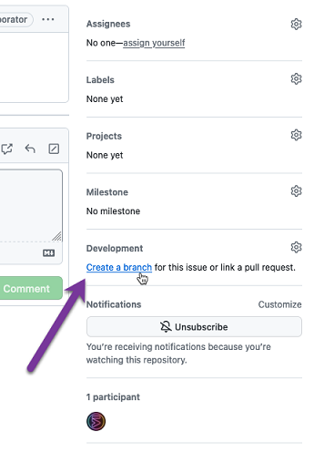
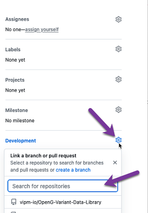

# OpenG Developer Guide (how to work on the code)
This is a guide to help you work on OpenG libraries.

See Also: [Upgrading Sources to LabVIEW 2020](library-upgrade-to-6.0.md)

The goal is to help you get a copy of the code in a running state, so that you can start making and testing improvements to share back with the community.

The setup process involves:

1. Setting up your development computer with the right version of LabVIEW
2. Obtaining the project source code and installing any package dependencies
3. Opening the project and running the unit tests to ensure the code is in a running state

Then, we'll describe the process for working on the code. Fixing bugs, adding features, creating tests, etc.

Let's go!

## Environment Setup

The following are details on how to set up your development environmet and get started contributing to OpenG.

### Use LabVIEW 2020 or 2024+

Nearly all OpenG libraries are saved in LabVIEW 2020.

However, you can work on the project using either (A) LabVIEW 2020 or (B) LabVIEW 2024 and newer (via the new `Save Version` feature in LabVIEW 2024).

> See the [See the `Save Version` section](#save-version-labview-feature), below, for details on how to use this feature in LabVIEW 2024

### Use Windows or Linux

Using either Windows or Linux should work fine, unless the library in question is platform specific.

### Install VIPM

It's recommended to use the latest version of [VIPM Desktop](https://docs.vipm.io). You can get that here: [vipm.io/desktop](https://www.vipm.io/desktop).

You can probably also just run VIPM and use the *Help >> Check for updates* feature to get the latest version of VIPM.

## Project Setup

### Download the OpenG library source code (using `git`)

If you don't have much experience with `git` (the command line source code control tool used for GitHub), then be sure to start with [GitHub Desktop](https://desktop.github.com/). It'll make it very easy to get started and perform common steps.

Typically, you can get a copy of the code using git via the command line with something like:

`git clone https://github.com/vipm-io/OpenG-Variant-Data-Library.git`

### Install VIPM Package Dependencies

You can probably just double-click on the `.vipc` file located in the `source/` folder of the project and VIPM will ask you if you want to install the packages.  Be sure to choose the correct version of LabVIEW and then proceed to install...

## Open the LabVIEW Project and Run the Tests

At this point you should be able to open the `.lvproj` in the root folder of the project.

Start by opening the `VI Tree - $LIBRARY_NAME.vi` and checking that it's not broken. On its block diagram you should find the library VIs.

Open the `test.vi` in the LabVIEW Project.  You can run it to run all of the unit tests in the project. If there are no errors, then everything is working!

### LabVIEW Project (`.lvproj`) Structure

The `${LIBRARY_NAME}.lvproj` LabVIEW project is generally organized to make it easy to work on the project.

At the top level are the following important files and folders:

- `VI Tree - ${LIBRARY_NAME}.vi` is a VI whose block diagram gives a visual overview of the library.
- `test.vi` is a VI that will run all unit tests in the project.
- `tests/` contains all the unit tests and generally mirrors the `tests/` folder on disk
- `source/` contains the library source code and generally mirrors the `source/` folder on disk

> See the [Project (on-disk) Folder and File Structure](#project-on-disk-files-and-folders) for details on what individual files and folders on disk are used for.

## Project Development

When working on OpenG repositories the correct workflow would be:
- Fork the repository
- Create an issue on Github
- Create a branch for this issue
- Clone the repository 
- Make changes to the source
- Commit changes and link your issue to this commit
- Create a pull request from the branch

### Creating a Branch in Git

On Github go to the issue you want work on and on the right side of the page you can create a branch for this issue. 

### Linking a Branch to other issue

If you want to work on multiple issues in the same branch you have the option to link a branch to other issues.

Go to the new issue on Github and select on the right side the gear icon next to the development header. Here you can select the brnach you are currently working in.

### Link Issue To Commit

If you use the correct format in your commit message, your commit will be automatically linked to a GitHub Issue. To do this, put a # followed the Issue number. This will automatically create a link in the commit message.

For example if you made a commit to repo and wrote the folllowing commit message:

> Fix bug #1337

this gets automatically converted to:

> Fix bug [#1337](https://www.github.com/vipm-io/OpenG-Tookit/issues/3)

### Creating Unit Tests with Caraya

[Caraya](https://www.vipm.io/package/jki_lib_caraya/) is the preferred unit test framework for OpenG. 

> Note: We are in the process of migrating unit tests of various libraries to use Caraya. If you'd like to help, writing simple tests is a great way to get familiar with the OpenG libraries and Caraya -- it's pretty simple, really.

### Editing the Functions Palette
[todo]

### Building the Package
[todo]

### Creating a Release
[todo]

## Other Useful Information

### How to use the `Save Version` feature in LabVIEW 2024 Q1

As mentioned, OpenG libraries can be edited and worked on using LabVIEW 2024 Q1, while keeping the `Save Version` of the project VIs and files in LV2020.

If you have not used this feature, please read this LabVIEW beta forum post:
- [LabVIEW-Public-Beta-Program / New-Feature-Developing-a-LabVIEW-Project-in-an-Older-Save](https://forums.ni.com/t5/LabVIEW-Public-Beta-Program-in/New-Feature-Developing-a-LabVIEW-Project-in-an-Older-Save/td-p/4350547)

> Important: This feature/setting only works for VIs configured for `Source Only`.  VIs that do not have this setting will always be saved in the editor's version of LabVIEW and **do not give any visual indication** that they are not using the `Save Version` feature.

#### Configuring LabVIEW 2024 to use the `Save Version` feature

If you want to use LV2024, you will need to set this `LabVIEW.ini` setting:
- `FeatureToggle.Editor.ProjectSaveVersion=True`

Note that the save version can be configured in the following locations:

- `.lvversion` file in the root folder of the project
- `${LIBRARY_NAME}.lvproj` project properties, as can be edited in the project's properties and also appearing in the `.lvproj` file XML data as `<Property Name="NI.LV.All.SaveVersion" Type="Str">20.0</Property>`
- `*.lvlib`, `*.lvclass`, etc. similar to the `.lvproj` properties.

Ideally, OpenG libraries will only configure the `.lvversion` file.

### Project (On-Disk) Files and Folders

- `${LIBRARY_NAME}.lvproj` is the main LabVIEW project for working on the library.
- `.lvversion` this is a text file that contains the two-digit LabVIEW version (e.g. `20.0`) that the project files are saved in. This file is used by LabVIEW 2024 and greater to specify the [Save Version](https://forums.ni.com/t5/LabVIEW-Public-Beta-Program-in/New-Feature-Developing-a-LabVIEW-Project-in-an-Older-Save/td-p/4350547) of the files in the project.  This allows developers to work on the project in newer versions of LabVIEW than the project files are saved in.
 - `source/` the LabVIEW source code for the library
    - `.vipc` a VI Package Configuration file containing the list of package dependencies of the library
    - `.vipb` The VI Package Build specifications file contains all the information needed by VIPM to build the VI Package (`.vip`) output file.
    - `library/` the library VIs
    - `examples/` example code

- `tests/` this folder contains software tests (e.g. unit tests) that are run automatically by CI and prior to building the package
    - `excluded_vis.txt` a text file that lists source VIs that do NOT require a unit test. This file is read by `Pre-Build VI - Run Unit Tests.vi` when determining whether to abort the build if there is not sufficient unit test coverage for all library VIs.
    - `test_${LIBRARY_NAME}.lvlib` this is a library that contains all the unit tests for the library.  Note: the library (`${LIBRARY_NAME}.lvib`) declares this test library as a "Friend" so that it can call any Community Scoped text helpers, which provide a way for the tests to call private members of the main library.
    - `TEST - VI_NAME.vi` are the unit test VIs for a givent VI (VI_NAME)
- `build support/` folder that contains various files used during the build process.
    - `Pre-Build VI - Run Unit Tests.vi` a custom action VI that VIPM's package builder runs before the build. It runs all of the unit tests, and aborts the package build if any tests fail.
    - `List VIs without Test Coverage.vi` a VI that identifies unit test coverage and can be used to ensure that every VI in the source folder has an associated unit test.
 - `.github/` files used by github for various CI tasks like testing and building. Generally, you can ignore this folder's contents.
 - `.all-contributorsrc` is a JSON file that contains metadata about project contributors and is used by @all-contributors to automate adding contributor information to the project.
 - `README.md` is the main github homepage of the library/project.